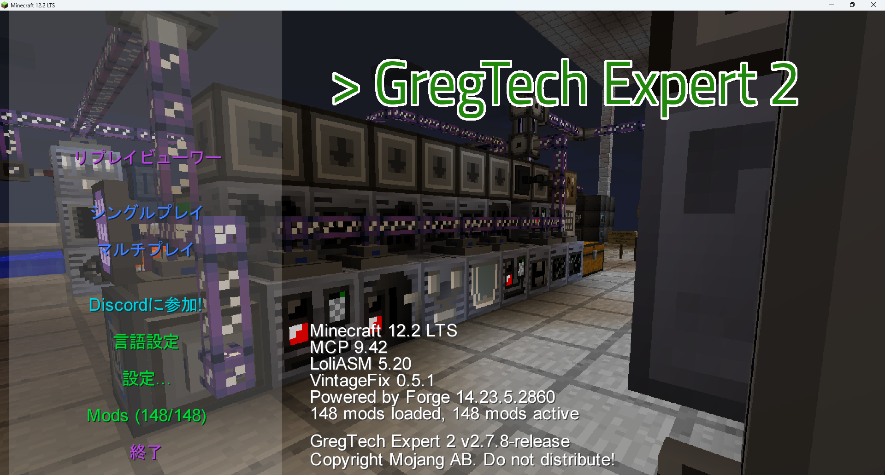

# GTE2-MainMenu-with-ReplayMod
CustomMainMenu settings for adding ReplayMod to GregTech Expert 2  
GregTech Expert 2にReplayModを追加するときのCustomMainMenuの設定  

**Add a ReplayViewer button to the main menu.**  
**メインメニューにReplayViewerボタンを追加.**

Please remove Valkyrie. It causes errors due to rendering issues.  
Valkyrieを削除してください。レンダリングの関係でエラーが発生します.  

# How to use (導入方法)
- Overwrite the `mainmenu.json` file located in the CustomMainMenu folder within the config directory.  
configフォルダにあるCustomMainMenuの設定ファイル`mainmenue.json`に上書きしてください

- Delete the `Valkyrie-**.jar` file from the Mods folder.  
Modsフォルダの`Valkyrie-**.jar`を削除.

